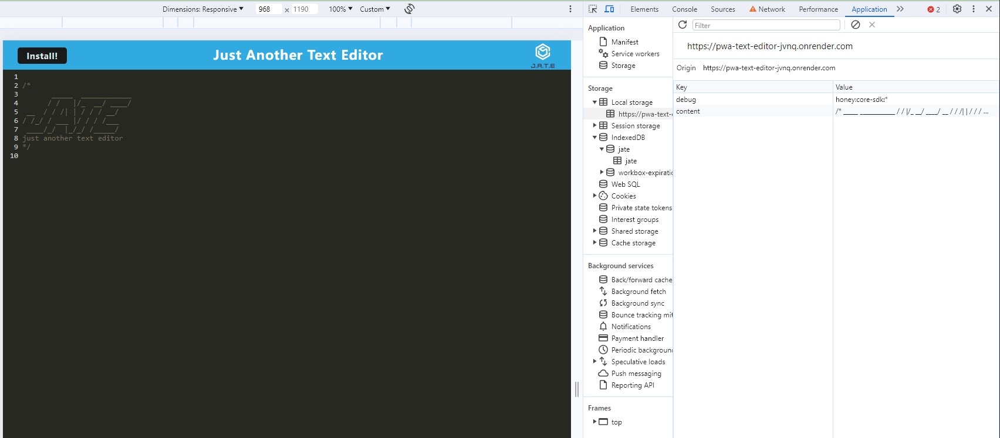
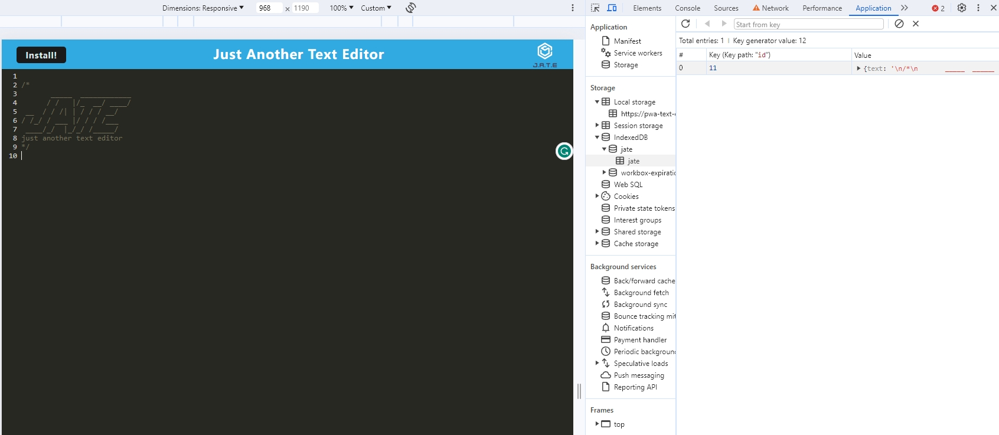
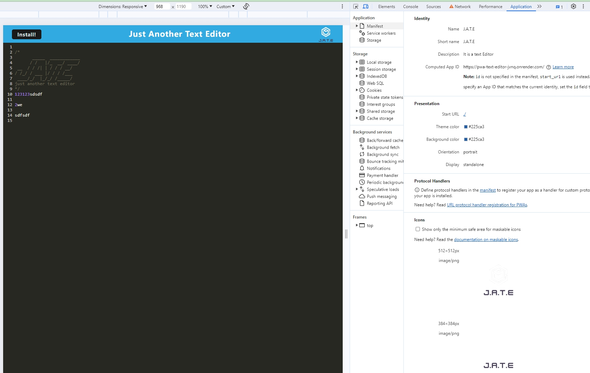
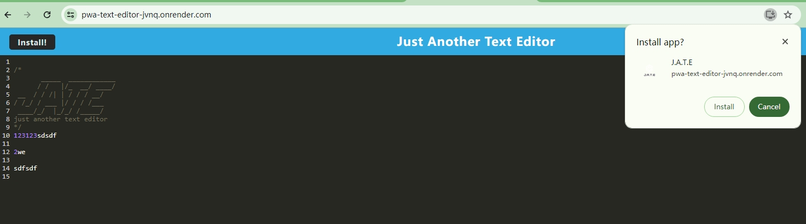
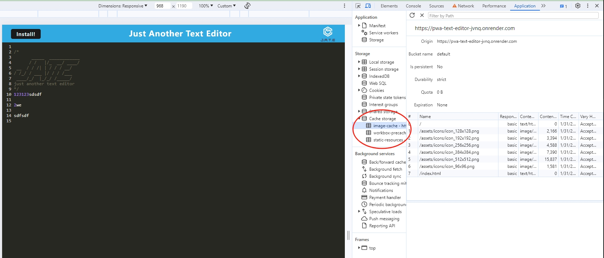
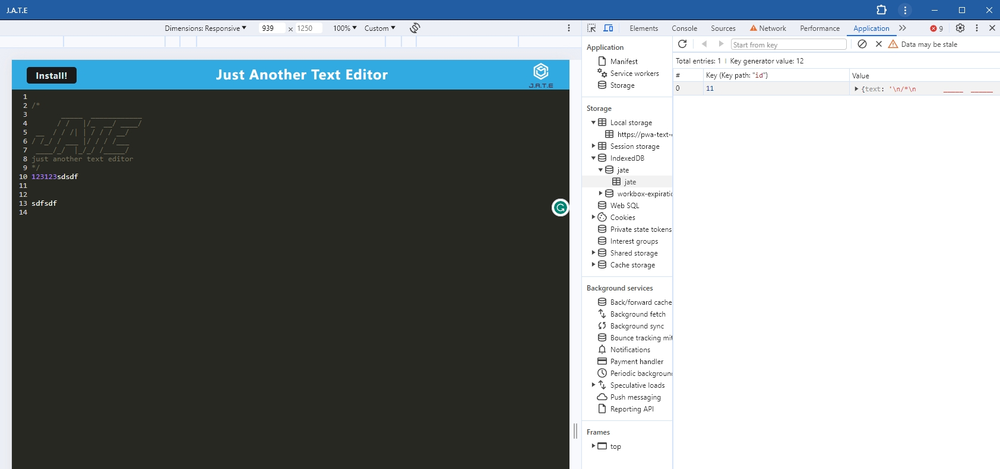

# textEditor-PWA

## Description

a Text Editor build with webpack, caching, IndexedDB, Manifest. allow the user to type text and store the info whenever reloaded. when installed the PWA, this app can run locally without internet connection.

## Table of Contents

- [Installation](#installation)
- [Usage](#usage)
- [License](#license)
- [Contribution](#contribution)
- [Test](#test)
- [Further Questions](#furtherquestions)

## Installation

for local installtion:

Open the directory from VS Code.

1. go to the db directory

2. run $npm install to install packages.

3. run the server $npm run start.

4. use localhost:3000 as the URL to run the app.

for online user:
1. simply open this link to use:
https://pwa-text-editor-jvnq.onrender.com

## Usage

1. typing in the main page, data stored in the localstorage, when lose focus, data on the page saves to the IndexDB

  
  

2. using manifest and service worker on this app

  
  
  

3. main data is cached, app can run without internet.

  
  

## License

N/A

## Contribution
You can contribute to this application by revising the codes here:  
https://github.com/mkdkck/textEditor-PWA

## Test
N/A

## FurtherQuestions

please review the codes here：  
https://github.com/mkdkck/textEditor-PWA

or contact the owner via: colin173@gmail.com

## Badges

